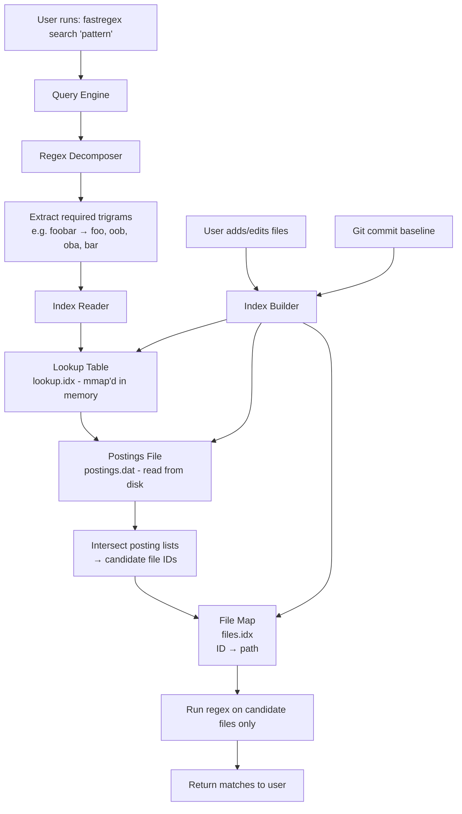
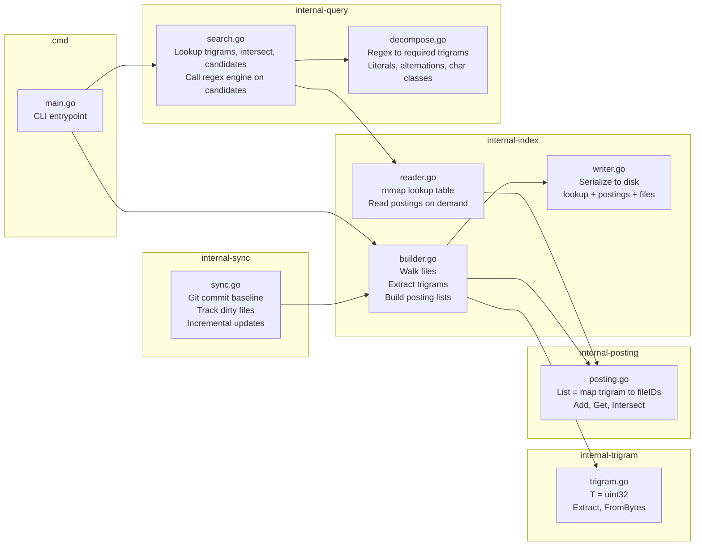
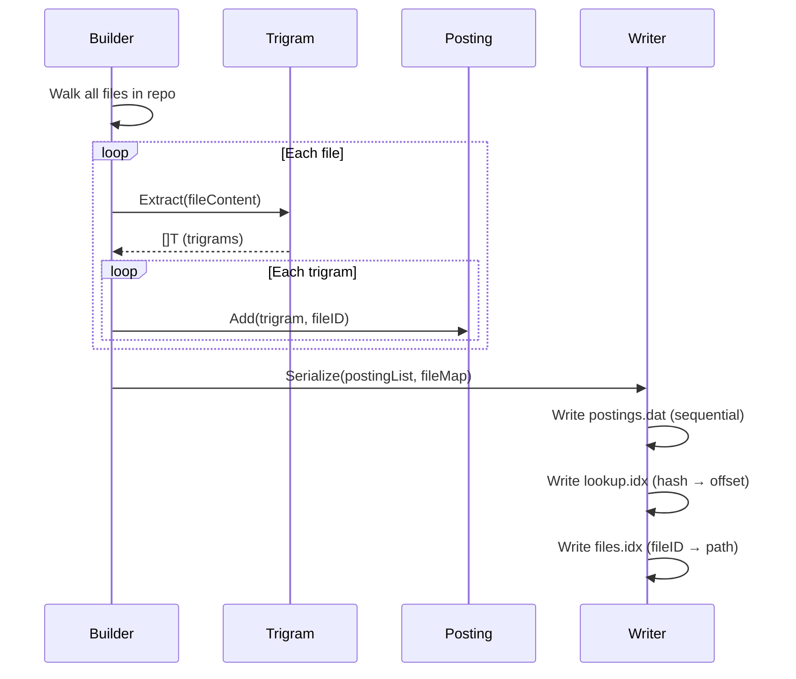
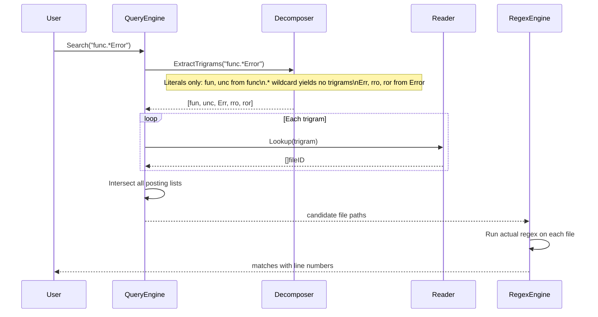
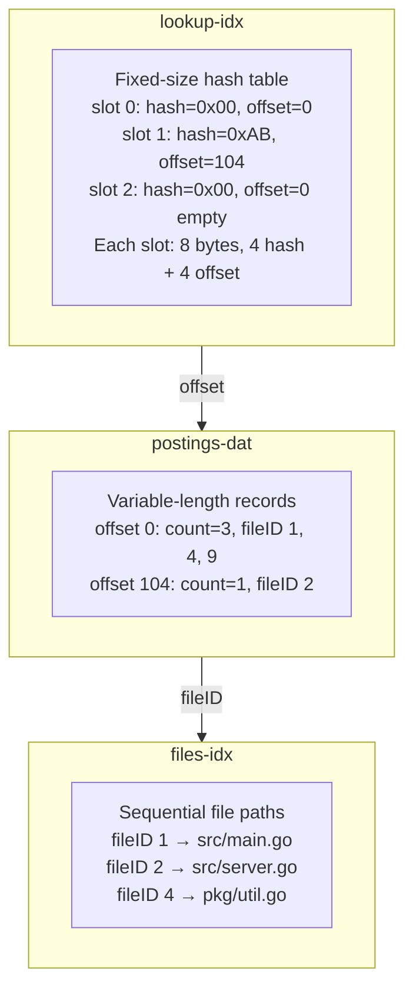
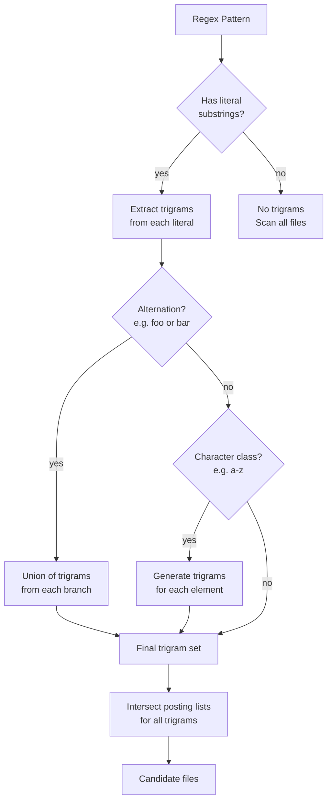
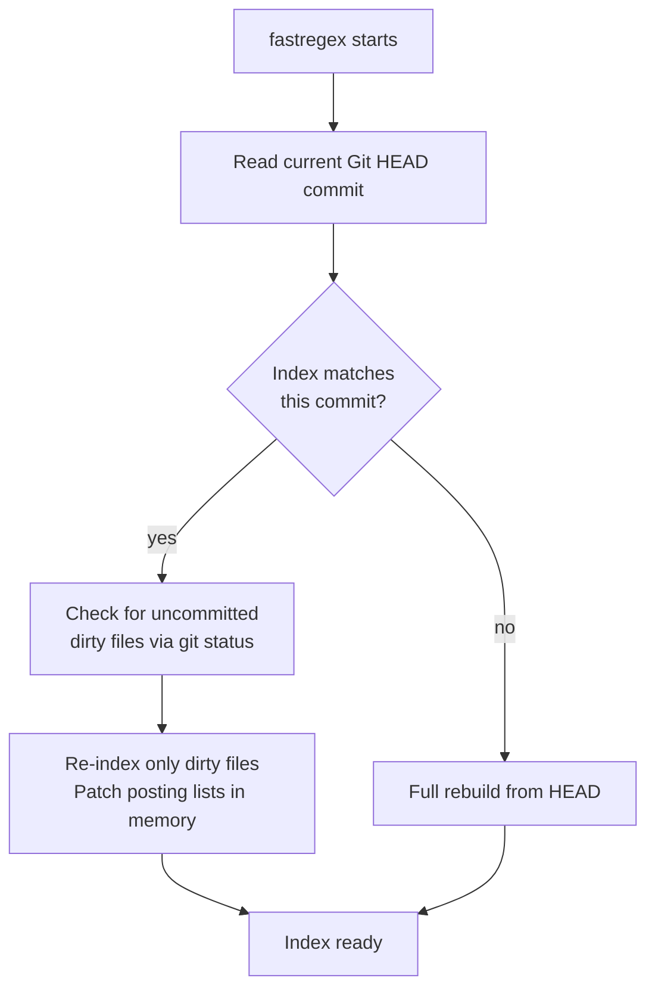
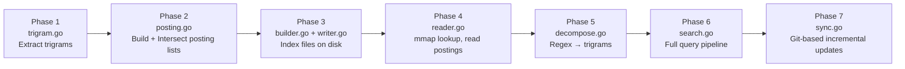

# FastRegex — Architecture

## Overview

FastRegex builds a local inverted index over a codebase so that regex queries
can skip irrelevant files entirely, instead of scanning every file like `ripgrep` does.

The index answers the question:
> "Which files *might* contain a match for this regex?"

Then ripgrep (or any regex engine) runs only on that small candidate set.

---

## High-Level Flow



---

## Component Architecture



---

## Data Flow: Index Build



---

## Data Flow: Query



---

## On-Disk Format



---

## Regex Decomposition Rules



---

## Incremental Sync Strategy



---

## Build Order (what to implement first)



---

## Map to Disk: The Translation Layer

### Problem: In-Memory Maps Can't Go Directly to Disk

A Go `map[uint32][]uint32` is a heap-allocated structure with pointer chains:

```go
m := make(map[uint32][]uint32)
m[0x12345678] = []uint32{1, 5, 9}
```

This creates:
- hmap struct with metadata
- Bucket array with pointers
- Key-value pairs in buckets
- Overflow chains for collisions

**This only works in RAM.** You cannot serialize it to disk and read it back as a map. What you get is raw bytes - no structure, no pointers.

### Solution: Convert Map to Disk Format

The architecture solves this with a three-phase approach:

```
┌──────────────────────────────────────────────────────────────────┐
│                        BUILD TIME                                │
│                                                                  │
│   builder.go              writer.go                              │
│   ┌──────────────┐       ┌──────────────────────────────────┐   │
│   │ map[uint32]   │  ──►  │ lookup.idx: fixed-size hash table│   │
│   │ []uint32      │       │ postings.dat: sequential records │   │
│   │ (in-memory)   │       │ files.idx: fileID → path         │   │
│   └──────────────┘       └──────────────────────────────────┘   │
└──────────────────────────────────────────────────────────────────┘
                              │
                              ▼
┌──────────────────────────────────────────────────────────────────┐
│                        QUERY TIME                                │
│                                                                  │
│   reader.go                                                       │
│   ┌──────────────────────────────────────────────────────────┐   │
│   │ 1. mmap lookup.idx (just bytes, no map!)                  │   │
│   │ 2. Binary search for hash                                  │   │
│   │ 3. Get offset → read postings.dat at that offset          │   │
│   │ 4. Return posting list                                     │   │
│   └──────────────────────────────────────────────────────────┘   │
└──────────────────────────────────────────────────────────────────┘
```

### Writer Serialization Process

```go
// Simplified writer.go logic
func WriteIndex(postingList map[uint32][]uint32) {
    // Step 1: Sort hashes for binary search
    sortedHashes := make([]uint32, 0, len(postingList))
    for hash := range postingList {
        sortedHashes = append(sortedHashes, hash)
    }
    sort.Slice(sortedHashes, func(i, j int) bool {
        return sortedHashes[i] < sortedHashes[j]
    })

    // Step 2: Write postings sequentially to postings.dat
    offsets := make([]uint32, len(sortedHashes))
    for i, hash := range sortedHashes {
        fileIDs := postingList[hash]
        offset := writePostings(fileIDs)  // returns file offset
        offsets[i] = offset
    }

    // Step 3: Write lookup table (hash → offset)
    // Fixed-size: 8 bytes per entry (4 bytes hash + 4 bytes offset)
    for i, hash := range sortedHashes {
        writeUint32(hash)
        writeUint32(offsets[i])
    }
}
```

### Reader Lookup Process

```go
// Simplified reader.go logic
func (r *Reader) Lookup(hash uint32) []uint32 {
    // Step 1: Binary search mmap'd lookup table
    offset := binarySearch(r.lookupTable, hash)
    if offset == 0 {
        return nil  // not found
    }

    // Step 2: Seek to offset in postings.dat
    r.postingsFile.Seek(offset, os.SEEK_SET)

    // Step 3: Read count + fileIDs
    count := readUint32()
    fileIDs := make([]uint32, count)
    for i := uint32(0); i < count; i++ {
        fileIDs[i] = readUint32()
    }
    return fileIDs
}
```

### Why This Works

| In-Memory Map | On-Disk Format |
|---------------|----------------|
| `m[key]` | Binary search on sorted array |
| Dynamic resize | Fixed size (pre-allocated at build) |
| Pointer chains | Just offsets (no pointers) |
| O(1) amortized | O(log n) search + O(1) read |
| GC managed | mmap'd - no GC, OS manages pages |

### Key Insight

> **The map exists only during BUILD time.** After writing to disk, it's gone.
> At query time, we reconstruct the lookup logic using the on-disk format.

This is why we have separate components:
- `builder.go` - builds in-memory map
- `writer.go` - converts map to disk format
- `reader.go` - queries disk format without needing a map

---

## Key Design Decisions

| Decision | Choice | Why |
|---|---|---|
| Trigram size | 3 chars | Bigrams = too many collisions, quadgrams = too many keys |
| Packing | `uint32` | O(1) map ops vs O(n) string comparison |
| Lookup table | Hash table, mmap'd | Stays in OS page cache, no heap allocation |
| Postings | Sequential on disk | Read only the lists you need, not the whole file |
| Hash collisions | Allowed | Widen candidate set (false positives ok), never miss matches |
| False negatives | Never allowed | The golden invariant: if a file matches, it must be a candidate |
| Index freshness | Git commit + dirty overlay | Fast startup, correct for agent workflows |
